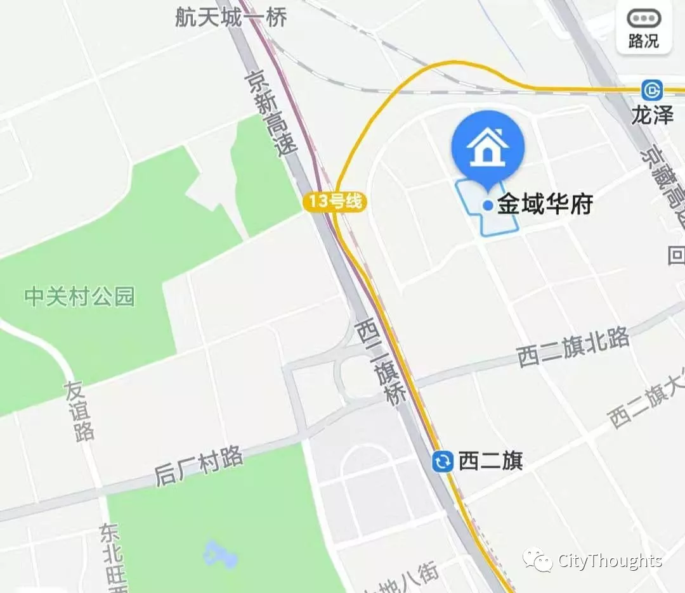

因为要赶早班的飞机，我提前在滴滴上预约了一辆专车。早上四点，司机师傅已经开着一辆日产在小区门口等着了。上车时感觉车子有点旧，车门关起来声音也很大。不过这都是小事，我因为在家待了太久很少和人聊天，于是就有一搭没一搭的和司机聊了起来。结果不聊不知道，一聊吓一跳。聊到最后我已经困意全无，下车时只恨为啥大清早不堵个车，这样还能多聊会儿。

言归正传，先说司机师傅本人。据其本人所述，他住的地方离我们小区很近，在万科金域华府。"金域华府？这小区我知道啊。"我说道。金域华府是万科开发，品质不错，但是价格也很高。小区房子一般一套三居价格在 600~700 万，两居 500~600 万，地库价格不知道。反正很贵就是了。我年中打算换房时这个小区都没敢进，而是去对面的融泽嘉园看了几套。金域华府位置也不错，小区离中国互联网中心的西二旗和后厂村路都是骑自行车的距离，见下图：

金域华府和融泽嘉园一般都是西城的拆迁户，手中大多握有多套房子。于是我随口问了一句："您在那应该也不止一套房子吧？" "嗯，我在那个小区有 10 套三居室，7 套两居室，还有 18 个地库。"

"啥？"这几个数字说的我有点晕，下巴差点掉到地上。司机师傅又说了一遍，我才确认我确实没听错。而今天送我去机场的司机师傅，确实是个亿万富翁！

这些房子是怎么来的呢？司机师傅是满族人，前些年在南锣鼓巷有一套 800 多平的前后四合院。2015 年的时候南锣鼓巷的四合院拆迁，于是在金域华府给他分了房子。为啥南锣鼓巷的 800 多平能换来这么多套房子？司机师傅也解释了下：首先 800 多平已经很大了，拆迁本来就可以多分几套;其次北京城区的四合院都是永久产权，而不是商品房的 70 年产权。拆一套少一套，因此价值天然比商品房要高的多。政府在分给他这么多房子的同时，又给了他相当数量的补偿金，具体多少，他没说。

"有这些房子，真是什么都不用愁了！"我感叹道。司机师傅继续淡定的说道："我还有一套呢！后海去过吧？宋庆龄故居的河对面，我那边的四合院还有 1200 多平。" 听完这些，我的下巴已经掉到了地上。这要是再拆迁，分到的房子和补偿金比南锣鼓巷那套只多不少啊！

于是我抛出了内心的疑问："像您这种身家的人，为啥还要大清早开滴滴来小区接我？实在有些不理解。如果是我，可能就全世界到处跑跑旅游去了。" 司机师傅答复道："世界上的大部分国家基本都去过了，都看过了。总不能一直闲着在家吧，总要找点事干。另外今天送完你去机场，正好我儿子 5 点多的飞机到北京，顺便接他回家。"

于是话题转向了他儿子。

他儿子和我同岁，都是 89 年生人。不过虽然是同龄人，他儿子非常优秀，以至于最后我都羞于谈论自己。据司机师傅讲，他儿子学习成绩一直名列前茅，后来直接跳过初中读了高中，参加高考后进入北大法律系读书，后来又继续去耶鲁大学进修，毕业后进去 IBM 法务部。目前担任部门主管。住在新泽西，每天开车去纽约上班。

关键人家儿子不仅学习好，课外活动也不差。身高 188，体重 270 斤。在国内时天天踢足球，去耶鲁以后加入校橄榄球队，继续担任主力。

这也太优秀了！我内心感叹了一下，继续抛出了下一个问题："有您这样的家庭作为支撑，您儿子的道路一定轻松了不少吧？" "不是，他 18 岁以后我就基本不怎么管他了，现在的一切都是他自己闯出来的。我当然可以让他过上不用工作也衣食无忧的生活，不过我不会那么做。资产是祖上留下来的，跟我和儿子都没多大关系。"司机师傅答道。看看人家这家庭教育理念，啧啧。

因为我想对他本人有更多的了解，后来话题继续转移到了司机师傅身上。司机师傅 58 年生人，一直在故宫负责文物的相关工作，在故宫工作了四十多年。聊起纪录片《我在故宫修文物》，师傅也非常熟悉。"那些文物修复前都要经过我手的。另外马未都知道吧？他每次去故宫我们都不爱搭理他。每次跟他说点什么事，第二天他就跑网上说去了。" 我很喜欢看马未都的节目《观复嘟嘟》，没想到今天还能遇到一个在文物方面比马未都还牛的人。师傅说现在经常有拍卖行来找他出去做文物鉴定，出场费十几万，但是他基本都推掉了。"要想一直保持水准，得经常看真品。出去给他们做鉴定，看太多假货，自己的水平都会下降，所以我不去。" 现在师傅已经退休，但是又被故宫返聘，因此有时每周也会去故宫待几天，发挥余热。

"多么圆满的人生啊！"我一边这么想着，抬头看向窗外。此时天空已经微亮，车子也已经驶入首都机场，我很快就要下车了。于是我问了师傅最后一个问题："像您这样圆满的人生，您还有什么梦想没实现吗？" 司机师傅想了下后回答说："还是有的，我以后可能会去延庆买片山水之地，然后在那里把我这些年关于文物的思考和见解都整理下来，出版成书。'躲进小屋成一统，管他春夏与秋冬'。" 说到这里，师傅还引用了一句鲁迅的诗。

话毕，车子靠边停靠。我拿起行李慢慢下车，车门依然在关闭时发出很大的声响。我走进机场，回想刚刚的经历，感觉像是刚做了一场梦。
