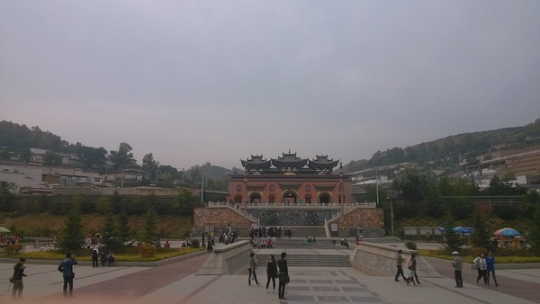
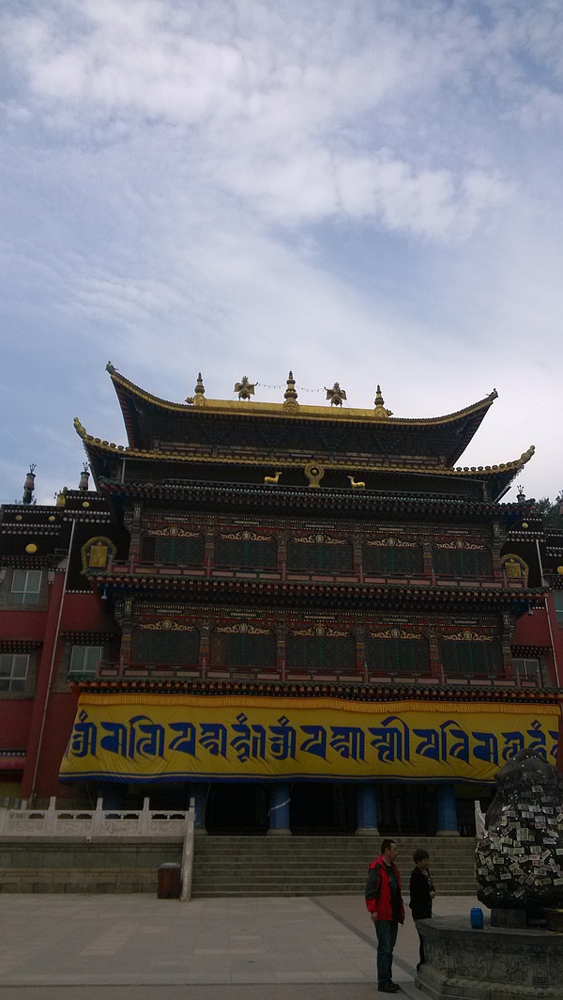
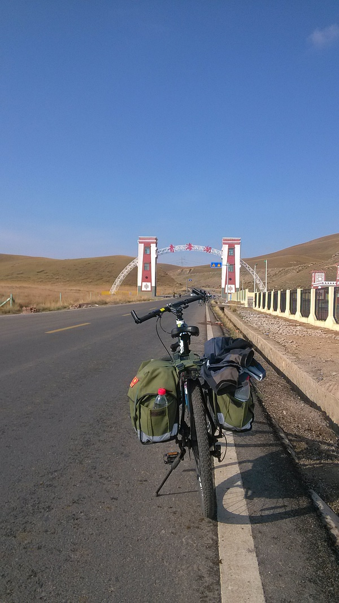
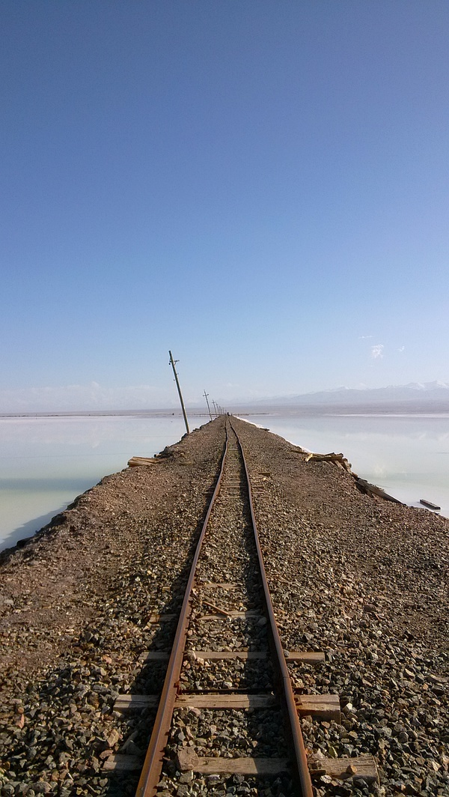
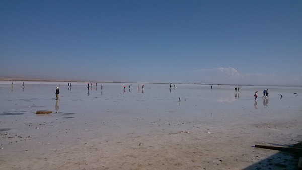
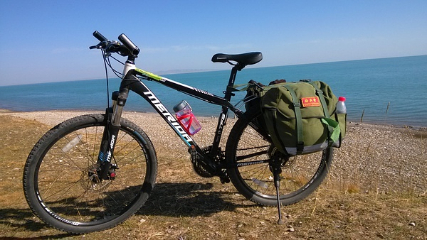
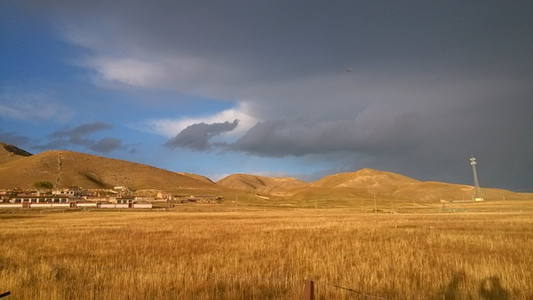
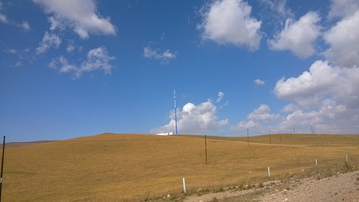

趁十一长假，和原同学、现同事寇一起去青海湖进行环湖骑行。谨记些流水账，以作备忘。

### 9月29号：塔尔寺之行

上午10点抵达西宁西站，之后乘公交去西宁市里的新宁广场南，然后走路到附近的汽车站坐车去塔尔寺。从汽车站坐车到塔尔寺大约需要2小时。

塔尔寺的门票80，门口有卖酿皮和酸奶的（酸奶比较好喝），还有很多卖纪念品的（千万不要买，也不要问）。塔尔寺是我逛过的第一座藏传佛教寺庙。寇同学说这里请愿很灵，不过我不相信这一套。如果某人向佛请愿，佛就满足了他的要求，我没有请，佛就不理我，那佛也太狭隘了吧？回归正题，塔尔寺很大，进去之后的感觉就是这真的是一个寺庙而不是一个旅游景点。因为到处都有喇嘛和前来朝拜的藏民。看了一下法事现场，虽然完全听不懂喇嘛们在说什么，但是还是挺震撼的。路上、寺院里到处都有不停做五体投地状的藏民也更加衬托了佛教的氛围。塔尔寺大殿很多，供奉着不同的佛和菩萨，且大都金光闪闪。到处都有转轮，到处都有哈达（旁边写着“自取，10块”）。寇许了好多愿，我一个也没拜，但是心里对这些佛还是尊敬的。

逛完塔尔寺，又坐车回西宁，然后有从西宁坐车去环湖的起点——西海镇。西海镇有很多租车的地方，我们挑了家叫“骑兵营”的租车店。我选了辆公爵600，押金500，价格是一天90，还算可以。挑完车就去了骑兵营安排的住宿地点。住宿的地方是一幢民居的卧室。里面摆了好多上下铺。不过我们去的时候就只有我和寇，因此相当于一个双人间了。住宿价格是一人一晚50。

### 9月30号：出发

上午8点出门，先在西海镇吃早饭。8点的西海镇只有一家饭店开门提供早饭，吃了碗牛肉面就出发了。

这一天的行程是从西海镇起到江西沟，距离在99公里左右。出了西海镇不远， 便是绵延的群山和牧场。我也是在这一天第一次见到了牦牛、藏民、沙漠、雪山。由于是秋天，山上金黄色已经代替了绿色。不过这高原的景色依然能够让我这个内陆来的没见过大世面的人感到新奇无比。上午遇到了好多上坡，不过还好都骑过来了。路上也有好多骑友，有上海来的两个妹子，有两个大学生，还有三个北京来的骑友。看来我们之前担心的遇到藏民抢劫的事不会发生了。中午路过一家小镇，于是就在这里挑了家小店吃了午餐。小店是夫妻店，只有两个人。做事风格和内地的完全不一样。我们进门喊了半天，到处找才找到老板。然后点了菜后，老板是一份一份做的，然后做的还巨慢，结果就是我都吃完了，寇同学的饭还正在做。吃过饭后下午继续骑，路上有藏族小姑娘打招呼，他们把我们当成风景来看，我们也是。

下午路过二郎剑景区，后来寇告诉我那就是151基地，真后悔没进去拍几张照片。

7点左右抵达江西沟。刚进江西沟就有藏民过来打招呼问要不要住店，一个小男孩说去他家住一晚才20.安全起见，我们选了骑兵营的江西沟分舵。一人50.

### 10月1号：盐湖之行

这一天的行程是从江西沟骑车到黑马河（46公里），然后在黑马河包车去茶卡盐湖。

第一天骑下来，屁股很痛。因此第二天的速度就放慢了些。不过还好这一天的压力不大。我们在下午1点半抵达黑马河，然后和另外两位骑友包车去茶卡盐湖。包车费用是280，一人70.从黑马河到茶卡盐湖有80公里，包车过去需要一个半小时。盐湖的门票是50.茶卡盐湖没有玻利维亚那么漂亮，不过像我等土包子见了还是兴奋不已。一湖的盐啊！盐湖上面浮着一层水，这是比较理想的状态。人站在盐湖上，能够清楚的看到自己的倒影。寇之前描述说“就像站在天上一样”。但是由于天上的云朵不给力，拍起来效果一般。盐湖里面有小火车，貌似做一次35，我们四个人沿着轨道往里走了一段时间，拍了些照片就回去了。在回去的路上，虽为汉人但是从小在这边长大的司机师傅给我们讲了很多藏民的故事。我也是第一次听说了藏民性开放的事迹，震惊不已（再次暴露了土包子的事实）。回到宾馆还没缓过来。从盐湖回来后买了路边藏民的苹果，个头不大，也不是很均匀，5块两斤。我们回宾馆品尝后都后悔不已，因为苹果实在是太好吃了，非常脆甜。我们决定下次遇到一定多买点。

### 10月3号：紧张的一天

由于前两天骑的太少，我们决定这一天多骑一点，这样就能为最后一天留出时间回西宁了。这一天的行程是从布哈河骑到哈尔盖镇，全程在95公里左右。

在70公里左右到达刚察县城。在县城我取了1000块钱，然后给北京的同学寄了两张明信片，然后又去了一家小店吃了包子。那包子的味道很熟悉。原来在纯朴的藏区，也有不放心肉啊。从刚察县城到哈尔盖的路上遭遇了风和乌云。一路上都比较难起，且不是有雨点打在身上，又被风干，又被打湿。骑得很慢，不过还是慢慢坚持到哈尔盖了。哈尔盖镇全镇只有一个招待所，还是政府开的。不过很便宜，一间房才70.且院里有一个联通信号塔，上网无压力。

### 10月4号：回到起点

这一天的行程是从哈尔盖骑到西海镇，全程在60公里左右。

这一天起得很早，然后没吃早饭就出发了（因为镇里没有提供早饭的店）。前面有几个上坡很难骑。在骑过一个大坡后，遇到了几位山西的骑友。他们给了我两小块驴肉，还让我喝劲酒。我吃了驴肉，但是没喝劲酒。然后又骑了一小段，遇到一个车胎被扎的哥们。下去帮他补胎，耽误了半个多小时。后面的二十公里骑得非常顺畅，以至于我们1点就到达西海镇了，比我们预定的早了一个小时。还车的时候，老板说我们是这一天唯一骑下来的，其他的都是半路撑不住包车拉回来的，心里有点小骄傲。还完车子，没有休息就直接坐车去西宁了。然后晚上逛了水井巷，买了好多藏饰和青稞酒，把自己都买破产了。

10月5号：启程回京，环青海湖骑行结束。
